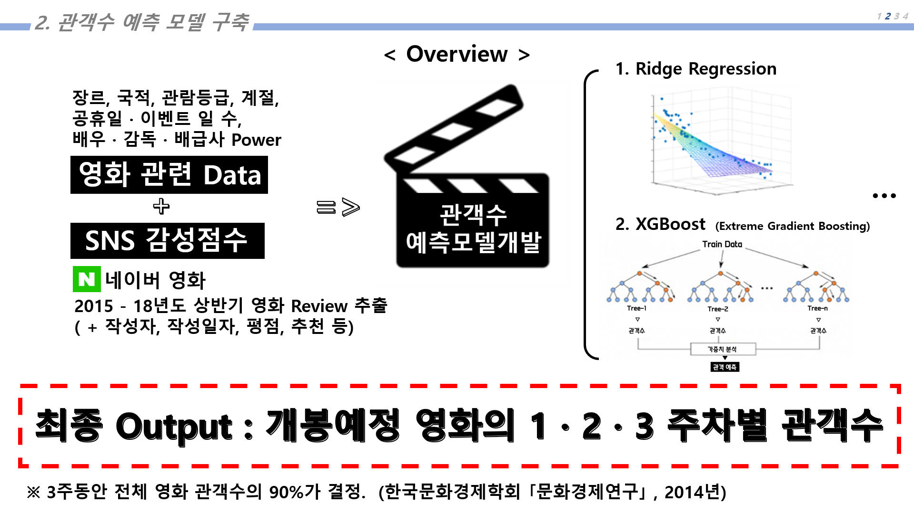
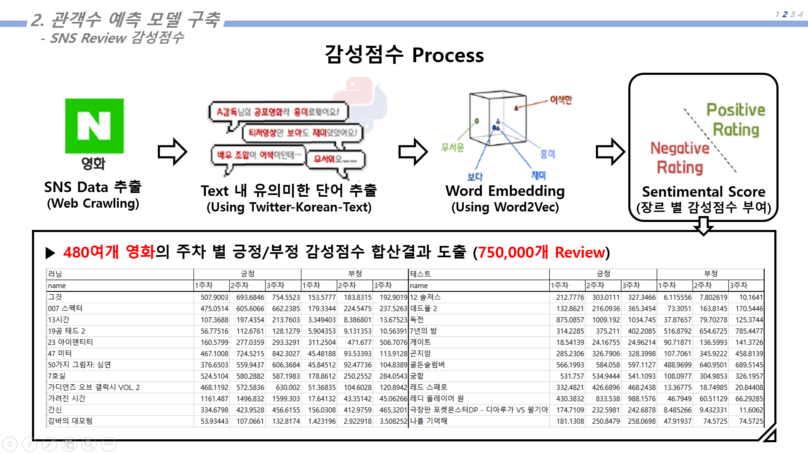

# 🥇 2018-2019 Group Contest to Solve Company Problem - [[Link](http://rnd.inha.ac.kr/schedule/view.htm?searchField=total&searchKeyword=%EC%B5%9C%EC%A2%85%EC%84%B1%EA%B3%BC&menuId=21&searchYear=2020&searchMonth=03&pageNo=1&scale=10&id=9300)]

## presentation file [[2018](https://drive.google.com/file/d/104yBgIiCIwUf-8YHaW0cl3XVjIaVnu7G/view?usp=sharing)] [[2019](https://drive.google.com/file/d/1-WYyIDNx5-EAF-6BGOP_9eWRCu64tLxO/view?usp=sharing)]

> `2018. 03. 01 ~ 2018. 11. 27`

> `2019. 03. 01 ~ 2020. 02. 01`

## Team

> 2018

- 강중석
- 김동환
- 김영교
- 김진욱
- 조윤성

> 2019

- 강중석
- 김민하
- 박세일
- 변예진
- 조윤성

## Idea

- Predicting the number of viewers with Big Data Analysis

- Improvement in the deficit for [C&B Multiplex, Inc.](http://m.cgv.co.kr/WebAPP/TheaterV4/TheaterDetail.aspx?tc=0207)

## Model Function

- Training the Word Of Mouth(WOM) Effects by Sentimental Analysis Model

- Training the Nine Key Variables About Movies by XGBoost Algorithm

## Data

- All movie data in Korea
- Naver review Data

## Stack

- Python
- [Word2vec](https://arxiv.org/pdf/1301.3781.pdf)
- [BERT](https://arxiv.org/abs/1810.04805)
- [XGBoost](https://arxiv.org/abs/1603.02754)
